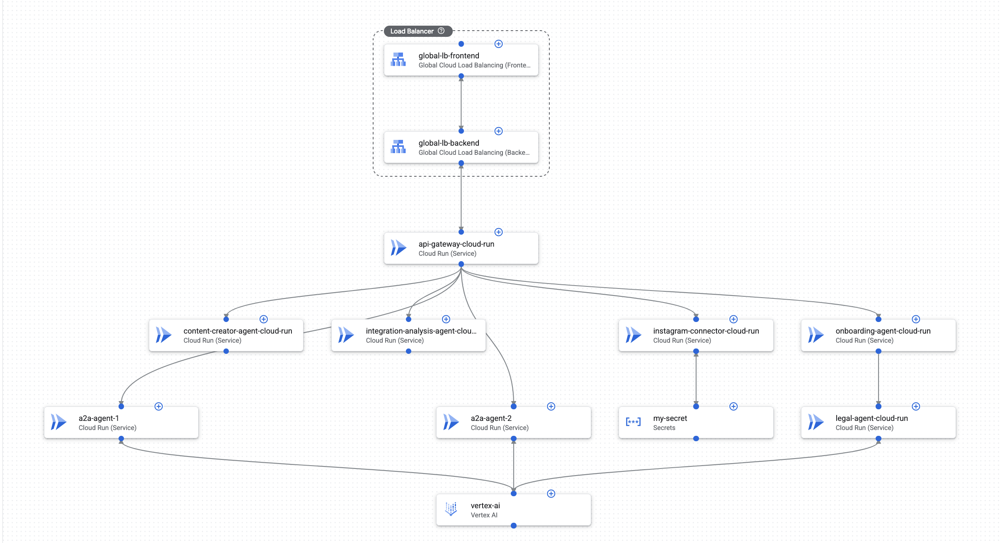

# Marketing AI Agency

> **Google Cloud Hackathon 2026 — Team 15**

An AI-powered marketing agency that automates business onboarding, strategy creation, content generation, and social media management. Built with **Google ADK** (Agent Development Kit), **Gemini Live Native Audio** for real-time voice conversations, and **Vertex AI** on Google Cloud.

**[View in Application Design Center](https://console.cloud.google.com/products/design-center/template/us-central1/default-space/marketing-agency-1?project=qwiklabs-asl-01-964394115550)**

## Demo

| Page | Description |
|------|-------------|
| **Voice Onboarding** | Real-time voice conversation with an AI agent using Gemini Live Native Audio. Collects business info hands-free. |
| **Marketing Strategy** | AI-generated marketing strategy with SWOT analysis, channel recommendations, and KPIs. |
| **Content Studio** | Content calendar with AI-powered creation for blog, Instagram, Twitter, and LinkedIn. |
| **Instagram** | Full Instagram mock UI with AI-driven post creation, research, and engagement tracking. |

## Architecture

### GCP Application Design Center (ADC)



**Cloud Run Services:**
| Service | Role |
|---------|------|
| **API Gateway** | Routes traffic to all agent services via internal load balancer |
| **Onboarding Agent** | Business intake with voice AI, delegates to Legal Agent |
| **Content Creator Agent** | Multi-platform content generation and calendar planning |
| **Integration Analysis Agent** | Engagement metrics, post analysis, and optimization |
| **Legal Agent** | Compliance checking (GDPR, CAN-SPAM, TCPA, FTC) |
| **Instagram Connector** | Instagram API integration with Secret Manager |
| **A2A Agent 1 & 2** | Agent-to-agent communication bridges via Vertex AI |

**Infrastructure:** Global Load Balancer + Cloud Armor + VPC + Prometheus monitoring

```
┌──────────────────────────────────────────────────────────┐
│              Global Load Balancer + Cloud Armor           │
└────────────────────────┬─────────────────────────────────┘
                         │
              ┌──────────▼──────────┐
              │   API Gateway       │
              │   (Cloud Run)       │
              └──┬───┬───┬───┬───┬──┘
                 │   │   │   │   │
    ┌────────────┘   │   │   │   └────────────┐
    ▼                ▼   │   ▼                ▼
┌──────────┐  ┌─────────┐│┌──────────┐  ┌──────────────┐
│Onboarding│  │ Content ││ │Instagram │  │ Integration  │
│  Agent   │  │ Creator ││ │Connector │  │  Analysis    │
└────┬─────┘  └─────────┘│ └──────────┘  └──────────────┘
     │                    │
     ▼                    ▼
┌──────────┐   ┌────────────────┐
│  Legal   │   │ A2A Agent 1&2  │
│  Agent   │   │  (Vertex AI)   │
└──────────┘   └────────────────┘
```

## Tech Stack

| Layer | Technology |
|-------|-----------|
| AI Framework | Google ADK (Agent Development Kit) |
| Voice Model | Gemini Live 2.5 Flash Native Audio |
| Text Model | Gemini 2.5 Flash via Vertex AI |
| Backend | Python 3.12 · FastAPI · WebSockets |
| Frontend | Next.js 15 · React 19 · TypeScript · Tailwind CSS |
| Auth | GCP Service Account · Vertex AI |
| Infra | Cloud Run · Global LB · Cloud Armor · Terraform · GitHub Actions CI/CD |

## Deployment

### Cloud Run (Production)

The project deploys to **Google Cloud Run** via GitHub Actions CI/CD. On every push to `main`:

1. Docker images are built and pushed to Artifact Registry
2. Backend is deployed to Cloud Run with Vertex AI access
3. Frontend is deployed to Cloud Run with backend URL injected

**Required GitHub Secrets:**

| Secret | Value |
|--------|-------|
| `GCP_PROJECT_ID` | Your GCP project ID |
| `WIF_PROVIDER` | Workload Identity Federation provider |
| `WIF_SERVICE_ACCOUNT` | GitHub Actions service account email |

### ADC Template (Full Architecture)

The `terraform-adc/` directory contains the Terraform exported from [Application Design Center](https://console.cloud.google.com/products/design-center/template/us-central1/default-space/marketing-agency-1?project=qwiklabs-asl-01-964394115550) with the full production architecture including load balancer, Cloud Armor, VPC, and all agent microservices.

## Key Features

- **Real-time Voice AI** — Bidirectional audio streaming via Gemini Live API with native audio (no STT/TTS pipeline)
- **Multi-Agent System** — Specialized agents for onboarding, strategy, content, and Instagram management
- **Google Search Grounding** — Strategy agent uses live web data for market research
- **Legal Compliance Check** — Onboarding agent validates marketing regulations by country
- **Mock Instagram** — Full Instagram-style UI for demo with AI-powered content creation

## Security & Compliance

### Cloud Armor Protection

The Onboarding Agent is protected by **Google Cloud Armor** (Model Armor) to prevent illegal or fraudulent businesses from using the platform. Requests are screened before reaching the agent, blocking attempts by prohibited businesses to market illicit products or services.

### Legal Agent — Country-Specific Compliance

The Onboarding Agent delegates to a dedicated **Legal Agent** that verifies marketing legality per country:

- Contacts the relevant **country marketing regulatory agency** to check whether the business and its products are legally allowed to be marketed in that jurisdiction
- Validates compliance with **GDPR** (EU), **CAN-SPAM** (US), **TCPA** (US SMS), **FTC** advertising guidelines, and country-specific regulations
- Flags businesses operating in restricted industries (tobacco, gambling, pharmaceuticals) that require special marketing permits
- Returns actionable compliance recommendations before any marketing campaign is launched

This ensures that only legitimate businesses with legal products can onboard and use the marketing agency's AI agents.

## Quick Start

### Prerequisites

- Python 3.11+
- Node.js 20+
- Google Cloud project with Vertex AI API enabled
- `gcloud` CLI installed and authenticated

### Setup

```bash
# Clone
git clone https://github.com/meije702/GoogleHack26-team15.git
cd GoogleHack26-team15

# Backend
cd backend
python -m venv venv
source venv/bin/activate
pip install -e .
cp .env.example .env   # Edit with your GCP project details
cd ..

# Frontend
cd frontend
npm install
cd ..
```

### GCP Authentication

```bash
# Option 1: Application Default Credentials
gcloud auth application-default login

# Option 2: Service Account (recommended for deployment)
# Place service-account.json in backend/ and set in .env:
# GOOGLE_APPLICATION_CREDENTIALS=service-account.json
```

### Run

```bash
# Terminal 1 — Backend
cd backend && source venv/bin/activate
uvicorn app.main:app --reload --port 8000

# Terminal 2 — Frontend
cd frontend && npm run dev
```

Open the frontend URL shown in the deploy output.

### Docker (Local Development)

```bash
docker compose up --build
```

## API Endpoints

| Method | Endpoint | Description |
|--------|----------|-------------|
| `GET` | `/api/health` | Health check |
| `POST` | `/api/chat/{agent}` | Text chat with any agent |
| `WS` | `/api/voice/{agent}` | Voice streaming (Gemini Live) |
| `GET` | `/api/instagram/posts` | List mock Instagram posts |
| `POST` | `/api/instagram/posts` | Create a mock post |
| `GET` | `/api/instagram/metrics` | Engagement metrics |
| `GET` | `/api/businesses` | List onboarded businesses |
| `GET` | `/api/agents` | List all available agents |

## Project Structure

```
├── backend/
│   ├── app/
│   │   ├── agents/
│   │   │   ├── onboarding_agent.py   # Voice onboarding (Gemini Live)
│   │   │   ├── strategy_agent.py     # Marketing strategy + Google Search
│   │   │   ├── content_agent.py      # Content calendar + multi-platform
│   │   │   ├── instagram_agent.py    # Research + posting + engagement
│   │   │   └── root_agent.py         # Orchestrator
│   │   ├── services/
│   │   │   ├── instagram_mock.py     # Mock Instagram API
│   │   │   └── memory_service.py     # ADK session management
│   │   └── main.py                   # FastAPI + WebSocket server
│   ├── pyproject.toml
│   └── Dockerfile
├── frontend/
│   ├── src/app/
│   │   ├── page.tsx                  # Dashboard
│   │   ├── onboarding/page.tsx       # Voice onboarding UI
│   │   ├── strategy/page.tsx         # Strategy chat
│   │   ├── content/page.tsx          # Content studio
│   │   └── instagram/page.tsx        # Instagram mock
│   ├── src/components/               # Shared components
│   ├── src/lib/                      # API client + utilities
│   ├── package.json
│   └── Dockerfile
├── terraform-adc/                    # ADC-exported Terraform (production)
│   ├── main.tf                       # All Cloud Run modules + LB + Cloud Armor
│   ├── outputs.tf                    # Service URIs + LB IPs
│   ├── providers.tf                  # Google provider config
│   ├── variables.tf                  # AppHub variables
│   └── adc-infra-design.png          # **Architecture diagram from ADC**
├── .github/workflows/
│   └── deploy.yml                    # GitHub Actions CI/CD pipeline
├── docs/
│   └── adc-architecture.png          # Architecture diagram for README
├── deploy.sh                         # Manual deploy script
├── docker-compose.yml                # Local development
└── README.md
```

## Team

**Team 15** — Google Cloud Hackathon, March 16, 2026

## License

MIT
